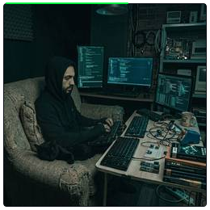

<div align="center">

<!-- ANIMATED TERMINAL HEADER -->
<a href="https://github.com/aymenhmaidiwastaken">
  
</a>

<br/>
<br/>
<!-- TYPING SVG -->
<a href="https://git.io/typing-svg">
  
</a>

</div>


## `whoami`

<table>
<tr>
<td width="300" align="center">
  <br/>
  <a href="https://github.com/aymenhmaidiwastaken">
    
  </a>
  <br/><br/>
</td>
<td>

```
aymen@github
──────────────────────────────────
OS        Developer Brain v4.2.0
Host      Aymen Hmaidi
Kernel    Full-Stack v3.0-LTS
Uptime    too long to remember
Packages  30 (github)
Shell     bash / zsh
Editor    VS Code [dark mode]
Terminal  wherever there's WiFi
CPU       Caffeine-Powered @ 3.4GHz
GPU       100% allocated to VS Code
Memory    15.8GiB / 16GiB [99%]
Status    "i code to cure my depression"
```

</td>
</tr>
</table>

---

## `about.md`

<div align="center">
  <a href="https://github.com/aymenhmaidiwastaken">
    
  </a>
</div>

---

## `projects/`

<!-- PROJECTS-START -->
<div align="center">
  <a href="https://github.com/aymenhmaidiwastaken">
    
  </a>
</div>

<br/>

<details>
<summary><code>ByePostman</code> — TypeScript</summary>
<br/>

> You don't need Postman anymore. Open-source, local-first API client. No account, no cloud, no telemetry.

[](https://github.com/aymenhmaidiwastaken/ByePostman)
</details>

<details>
<summary><code>iHateGrammarly</code> — TypeScript</summary>
<br/>

> Grammarly rejected me, so I built an open-source alternative. 100% local, 100% free, 0% spyware.

[](https://github.com/aymenhmaidiwastaken/iHateGrammarly)
</details>

<details>
<summary><code>easyrag</code> — FastAPI</summary>
<br/>

> RAG in 10 lines. No PhD required. Chat with your documents, codebase, or any text data — locally or via cloud APIs. Dead-simple Python library and CLI for Retrieval-Augmented Generation.

[](https://github.com/aymenhmaidiwastaken/easyrag)
</details>

<details>
<summary><code>internship-finder</code> — FastAPI</summary>
<br/>

> Full-stack internship search tool that scrapes LinkedIn, Adzuna, TheMuse & more. Smart autocomplete, filters, 8 languages. Built with Next.js + FastAPI.

[](https://github.com/aymenhmaidiwastaken/internship-finder)
</details>

<details>
<summary><code>cli-recorder</code> — Node.js</summary>
<br/>

> Terminal session recorder — record, play back, and export terminal sessions to GIF or MP4. Asciicast v2 compatible.

[](https://github.com/aymenhmaidiwastaken/cli-recorder)
</details>

<details>
<summary><code>catfish-detector</code> — FastAPI</summary>
<br/>

> Upload a photo, get the truth. Reverse image search + AI face analysis + metadata forensics to detect catfish profile photos.

[](https://github.com/aymenhmaidiwastaken/catfish-detector)
</details>

<details>
<summary><code>BoomAi</code> — Next.js</summary>
<br/>

> AI-powered content generation platform — text, images, and code. Built with Next.js 14 and Laravel 11. User auth, pricing plans, blog, dark/light mode.

[](https://github.com/aymenhmaidiwastaken/BoomAi)
</details>

<details>
<summary><code>Melkeya</code> — Next.js</summary>
<br/>

> Full-stack real estate platform for the UAE market. Built with Next.js 12, Express.js, MongoDB, and Firebase. JWT auth, email verification, property listings with image uploads, and search filters.

[](https://github.com/aymenhmaidiwastaken/Melkeya)
</details>

<details>
<summary><code>Boomash</code> — Laravel</summary>
<br/>

> Full-stack admin dashboard with dark/orange theme. Built with Laravel 11, Inertia.js, Vue 3, and Bootstrap 5. Includes analytics, chat, kanban tasks, calendar, and 2FA.

[](https://github.com/aymenhmaidiwastaken/Boomash)
</details>

<details>
<summary><code>OpenBoilerplate</code> — React</summary>
<br/>

> The ultimate open-source SaaS boilerplate. Ship in record time with Astro 5, React 19, Tailwind CSS 4, and shadcn/ui. Swap auth, payments, database & AI providers with one config change. 30+ production-ready pages included.

[](https://github.com/aymenhmaidiwastaken/OpenBoilerplate)
</details>

<details>
<summary><code>AgroCare</code> — Python</summary>
<br/>

> Plant disease detection & comparison using LLM agents, bcrypt auth, and MongoDB history

[](https://github.com/aymenhmaidiwastaken/AgroCare)
</details>

<details>
<summary><code>seo-article-generator</code> — Python</summary>
<br/>

> The most powerful open-source AI-powered SEO article generator. Crawl thousands of articles from 5 search engines,   extract clean content, and rewrite them into unique SEO-optimized articles using local AI (Ollama) — all from a single    command. No API keys. No limits. Free forever.

[](https://github.com/aymenhmaidiwastaken/seo-article-generator)
</details>

<details>
<summary><code>daily-country-search-trends</code> — Chrome Extension</summary>
<br/>

> Chrome extension that automatically posts the top 10 Google search trends for 195 countries to X/Twitter   every day. Powered by Google Trends.

[](https://github.com/aymenhmaidiwastaken/daily-country-search-trends)
</details>

<details>
<summary><code>promptcheck</code> — Python</summary>
<br/>

> Pytest for your LLM prompts. Catch regressions before production.

[](https://github.com/aymenhmaidiwastaken/promptcheck)
</details>

<details>
<summary><code>lazydb</code> — Go</summary>
<br/>

> One TUI to query them all. Terminal UI database client for PostgreSQL, MySQL, SQLite, MongoDB, and Redis. Single binary, keyboard-driven, 9 themes.

[](https://github.com/aymenhmaidiwastaken/lazydb)
</details>

<details>
<summary><code>gitviz</code> — Rust</summary>
<br/>

> See your git history like never before. Analyze any repo and generate beautiful HTML dashboards with contribution heatmaps, risk scoring, code ownership, collaboration graphs, and more.

[](https://github.com/aymenhmaidiwastaken/gitviz)
</details>

<details>
<summary><code>OpenPdf</code> — FastAPI</summary>
<br/>

> Free open-source PDF toolkit with 30+ tools : merge, split, compress, convert, OCR, encrypt & more. Self-hosted iLovePDF alternative built with Next.js 15 & FastAPI. No signup, no limits, privacy-first.

[](https://github.com/aymenhmaidiwastaken/OpenPdf)
</details>

<details>
<summary><code>instagram-sent-requests-remover</code> — Chrome Extension</summary>
<br/>

> A secure Chrome extension to automatically withdraw all your pending outgoing follow requests on Instagram using your official data archive.

[](https://github.com/aymenhmaidiwastaken/instagram-sent-requests-remover)
</details>

<details>
<summary><code>reddit-auto-promoter</code> — Python</summary>
<br/>

> AI-powered Reddit marketing bot — generates human-like comments and posts using Ollama/Llama 3   with anti-detection browser automation, multi-account rotation, and smart promotion targeting across 60+ subreddits.

[](https://github.com/aymenhmaidiwastaken/reddit-auto-promoter)
</details>

<details>
<summary><code>GeoSnap</code> — Node.js</summary>
<br/>

> AI-powered photo geolocation tool — upload any photo and AI analyzes visual clues to pinpoint the exact location on an interactive map. Built with Node.js, Gemini Vision AI, and Leaflet.js.

[](https://github.com/aymenhmaidiwastaken/GeoSnap)
</details>

<details>
<summary><code>devboot</code> — Go</summary>
<br/>

> Fresh machine to productive in one command. Dev environment bootstrapper from a single YAML config.

[](https://github.com/aymenhmaidiwastaken/devboot)
</details>

<details>
<summary><code>gitwise</code> — Go</summary>
<br/>

> AI-powered commit messages and PR descriptions from your terminal. Works with Ollama, OpenAI, Anthropic, Gemini, and any OpenAI-compatible endpoint.

[](https://github.com/aymenhmaidiwastaken/gitwise)
</details>

<details>
<summary><code>envsafe</code> — Rust</summary>
<br/>

> Your secrets, encrypted, everywhere. Universal .env and secrets manager with encrypted vault, environment profiles, cloud sync, and more.

[](https://github.com/aymenhmaidiwastaken/envsafe)
</details>

<details>
<summary><code>SEO-Optimiser</code> — Python</summary>
<br/>

> Self-contained SEO analysis tool with a web dashboard. Crawl any website, analyze 8 categories (technical, on-page, content, structured data, performance, security, accessibility, links), get a 0-100 score, and receive ready-to-use fixes — no external APIs needed.

[](https://github.com/aymenhmaidiwastaken/SEO-Optimiser)
</details>

<details>
<summary><code>cosmicwatch</code> — Python</summary>
<br/>

> AI-powered Earth & Space monitoring platform. Analyzes 5,000+ exoplanets, tracks near-Earth asteroids, monitors global wildfires using NASA satellite data with machine learning pipelines (KMeans, Isolation   Forest, ARIMA forecasting) and interactive Plotly Dash dashboard.

[](https://github.com/aymenhmaidiwastaken/cosmicwatch)
</details>

<details>
<summary><code>Shopify-Seo</code> — Chrome Extension</summary>
<br/>

> Free Chrome extension for comprehensive Shopify SEO analysis. 50+ checks, real Core Web Vitals, site crawler, Google   rank tracker, competitor comparison, internal link map, and PDF reports. No API keys, no signup, no cost.

[](https://github.com/aymenhmaidiwastaken/Shopify-Seo)
</details>

<details>
<summary><code>Css-Sniffer</code> — Chrome Extension</summary>
<br/>

> The ultimate CSS inspection & design system extraction Chrome extension — hover-inspect, live-edit, extract design   tokens, audit performance, detect patterns, export to React/Vue/Svelte/Tailwind, and more. Zero dependencies.

[](https://github.com/aymenhmaidiwastaken/Css-Sniffer)
</details>

<details>
<summary><code>linkedin-auto-connect</code> — Chrome Extension</summary>
<br/>

> Chrome extension to automatically send LinkedIn connection requests — bulk connect from My Network or Search results with smart delays and weekly limit tracking

[](https://github.com/aymenhmaidiwastaken/linkedin-auto-connect)
</details>

<details>
<summary><code>unsender-for-facebook</code> — Chrome Extension</summary>
<br/>

> Unsend all your sent messages in any Facebook Messenger conversation with one click. Chrome extension that scrolls through your entire chat history automatically.

[](https://github.com/aymenhmaidiwastaken/unsender-for-facebook)
</details>

<details>
<summary><code>unsender-for-instagram</code> — Chrome Extension</summary>
<br/>

> Unsend all your sent messages in any Instagram DM conversation with one click. Chrome extension that scrolls through your entire chat history automatically.

[](https://github.com/aymenhmaidiwastaken/unsender-for-instagram)
</details>
<!-- PROJECTS-END -->

---

## `weapons of choice`

<div align="center">

**`// Languages`**


**`// Frameworks & Libraries`**


**`// Tools & Infrastructure`**


</div>

---

## `ping me`

<div align="center">

<br/>

[](https://linkedin.com/in/aymenhmaidi)
[](https://instagram.com/aymenhmaidi)
[](https://facebook.com/Aymenhmaidi69)
[](https://youtube.com/@sangour.mp4)

<br/>

</div>

---

<div align="center">

## `exit`

```


  ██████╗  ██████╗      ██████╗██╗  ██╗███████╗ ██████╗██╗  ██╗
 ██╔════╝ ██╔═══██╗    ██╔════╝██║  ██║██╔════╝██╔════╝██║ ██╔╝
 ██║  ███╗██║   ██║    ██║     ███████║█████╗  ██║     █████╔╝
 ██║   ██║██║   ██║    ██║     ██╔══██║██╔══╝  ██║     ██╔═██╗
 ╚██████╔╝╚██████╔╝    ╚██████╗██║  ██║███████╗╚██████╗██║  ╚██╗
  ╚═════╝  ╚═════╝      ╚═════╝╚═╝  ╚═╝╚══════╝ ╚═════╝╚═╝   ╚═╝

  ███╗   ███╗██╗   ██╗    ██████╗ ███████╗██████╗  ██████╗ ███████╗
  ████╗ ████║╚██╗ ██╔╝    ██╔══██╗██╔════╝██╔══██╗██╔═══██╗██╔════╝
  ██╔████╔██║ ╚████╔╝     ██████╔╝█████╗  ██████╔╝██║   ██║███████╗
  ██║╚██╔╝██║  ╚██╔╝      ██╔══██╗██╔══╝  ██╔═══╝ ██║   ██║╚════██║
  ██║ ╚═╝ ██║   ██║       ██║  ██║███████╗██║     ╚██████╔╝███████║
  ╚═╝     ╚═╝   ╚═╝       ╚═╝  ╚═╝╚══════╝╚═╝      ╚═════╝ ╚══════╝
                                                              ↑ ↑ ↑

  Connection to github.com closed.

```


</div>
