<div align="center">

<!-- ANIMATED TERMINAL HEADER -->
<a href="https://github.com/aymenhmaidiwastaken">
  
</a>

<br/>

<!-- TYPING SVG -->
<a href="https://git.io/typing-svg">
  
</a>

</div>

<br/>

## `whoami`

<table>
<tr>
<td width="300" align="center">
  <br/>
  <a href="https://github.com/aymenhmaidiwastaken">
    
  </a>
  <br/><br/>
</td>
<td>

```
aymen@github
──────────────────────────────────
OS        Developer Brain v4.2.0
Host      Aymen Hmaidi
Kernel    Full-Stack v3.0-LTS
Uptime    too long to remember
Packages  11 (github)
Shell     bash / zsh
Editor    VS Code [dark mode]
Terminal  wherever there's WiFi
CPU       Caffeine-Powered @ 3.4GHz
GPU       100% allocated to VS Code
Memory    15.8GiB / 16GiB [99%]
Status    "i code to cure my depression"
```

</td>
</tr>
</table>

---

## `about.md`

<div align="center">
  <a href="https://github.com/aymenhmaidiwastaken">
    
  </a>
</div>

---

## `projects/`

<!-- PROJECTS-START -->
```
aymen@github:~$ tree ~/projects --info

projects/
│
├── 🔥 linkedin-auto-connect
│   ├── desc:  Chrome extension to automatically send LinkedIn connection req...
│   └── tech:  JavaScript
│
├── 🔥 unsender-for-facebook
│   ├── desc:  Unsend all your sent messages in any Facebook Messenger conver...
│   └── tech:  JavaScript
│
├── 🔥 unsender-for-instagram
│   ├── desc:  Unsend all your sent messages in any Instagram DM conversation...
│   └── tech:  JavaScript
│
├── 🎯 OpenBoil
│   ├── desc:  The ultimate open-source SaaS boilerplate. Ship in record time...
│   └── tech:  TypeScript
│
├── 🐍 seo-article-generator
│   ├── desc:  The most powerful open-source AI-powered SEO article generator...
│   └── tech:  Python
│
├── 🔥 daily-country-search-trends
│   ├── desc:  Chrome extension that automatically posts the top 10 Google se...
│   └── tech:  JavaScript
│
├── 🎨 BoomAi
│   ├── desc:  AI-powered content generation platform built with   Next.js 14...
│   └── tech:  SCSS
│
├── 🎨 Boomash
│   ├── desc:  Laravel/Vue Js Admin Dashboard
│   └── tech:  SCSS
│
├── 🎯 seektalent
│   ├── desc:  the ultimate talent hub platform
│   └── tech:  TypeScript
│
├── 🔥 Melkeya
│   ├── desc:  Nextjs/Nodejs Real estate platform for the UAE market
│   └── tech:  JavaScript
│
└── 🐍 AgroCare
    ├── desc:  Plant disease detection & comparison using LLM agents, bcrypt ...
    └── tech:  Python

11 directories, ∞ lines of code
```

<div align="center">

[](https://github.com/aymenhmaidiwastaken/linkedin-auto-connect)
[](https://github.com/aymenhmaidiwastaken/unsender-for-facebook)
[](https://github.com/aymenhmaidiwastaken/unsender-for-instagram)
[](https://github.com/aymenhmaidiwastaken/OpenBoil)
[](https://github.com/aymenhmaidiwastaken/seo-article-generator)
[](https://github.com/aymenhmaidiwastaken/daily-country-search-trends)
[](https://github.com/aymenhmaidiwastaken/BoomAi)
[](https://github.com/aymenhmaidiwastaken/Boomash)
[](https://github.com/aymenhmaidiwastaken/seektalent)
[](https://github.com/aymenhmaidiwastaken/Melkeya)
[](https://github.com/aymenhmaidiwastaken/AgroCare)

</div>
<!-- PROJECTS-END -->

---

## `weapons of choice`

<div align="center">

**`// Languages`**


**`// Frameworks & Libraries`**


**`// Tools & Infrastructure`**


</div>

---

## `ping me`

<div align="center">

<br/>

[](https://linkedin.com/in/aymenhmaidi)
[](https://instagram.com/aymenhmaidi)
[](https://facebook.com/Aymenhmaidi69)
[](https://youtube.com/@sangour.mp4)

<br/>

</div>

---

<div align="center">

## `exit`

```


  ██████╗  ██████╗      ██████╗██╗  ██╗███████╗ ██████╗██╗  ██╗
 ██╔════╝ ██╔═══██╗    ██╔════╝██║  ██║██╔════╝██╔════╝██║ ██╔╝
 ██║  ███╗██║   ██║    ██║     ███████║█████╗  ██║     █████╔╝
 ██║   ██║██║   ██║    ██║     ██╔══██║██╔══╝  ██║     ██╔═██╗
 ╚██████╔╝╚██████╔╝    ╚██████╗██║  ██║███████╗╚██████╗██║  ╚██╗
  ╚═════╝  ╚═════╝      ╚═════╝╚═╝  ╚═╝╚══════╝ ╚═════╝╚═╝   ╚═╝

  ███╗   ███╗██╗   ██╗    ██████╗ ███████╗██████╗  ██████╗ ███████╗
  ████╗ ████║╚██╗ ██╔╝    ██╔══██╗██╔════╝██╔══██╗██╔═══██╗██╔════╝
  ██╔████╔██║ ╚████╔╝     ██████╔╝█████╗  ██████╔╝██║   ██║███████╗
  ██║╚██╔╝██║  ╚██╔╝      ██╔══██╗██╔══╝  ██╔═══╝ ██║   ██║╚════██║
  ██║ ╚═╝ ██║   ██║       ██║  ██║███████╗██║     ╚██████╔╝███████║
  ╚═╝     ╚═╝   ╚═╝       ╚═╝  ╚═╝╚══════╝╚═╝      ╚═════╝ ╚══════╝
                                                              ↑ ↑ ↑

  Connection to github.com closed.

```


</div>
